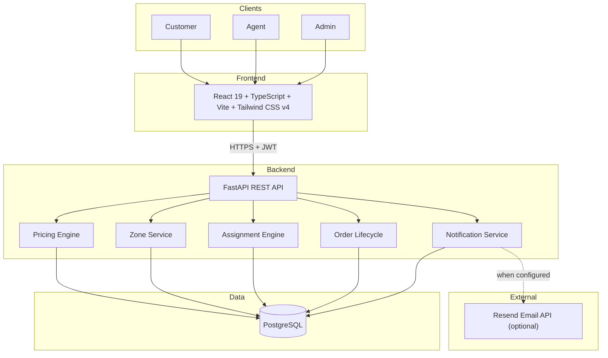
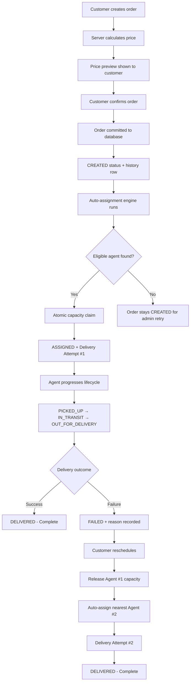
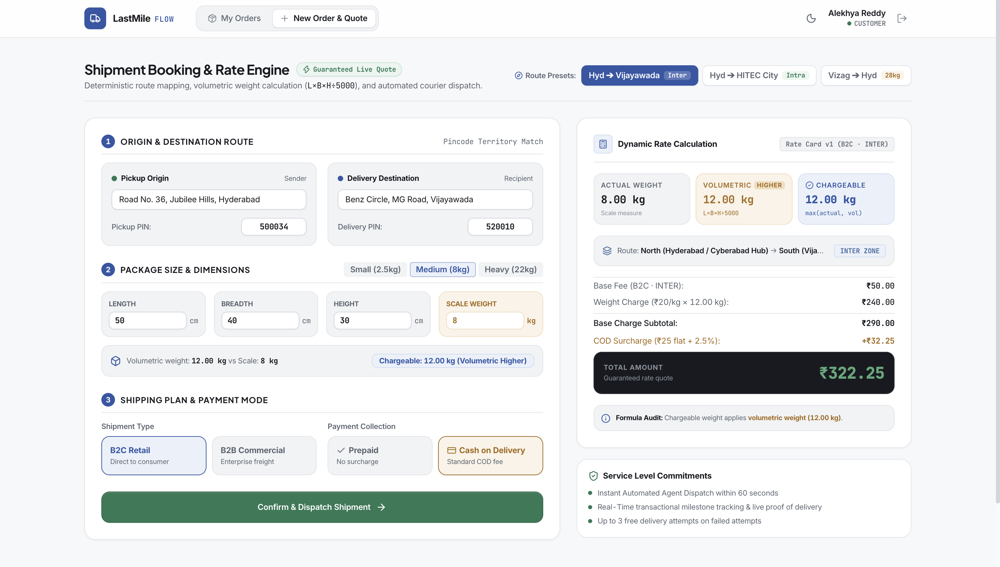
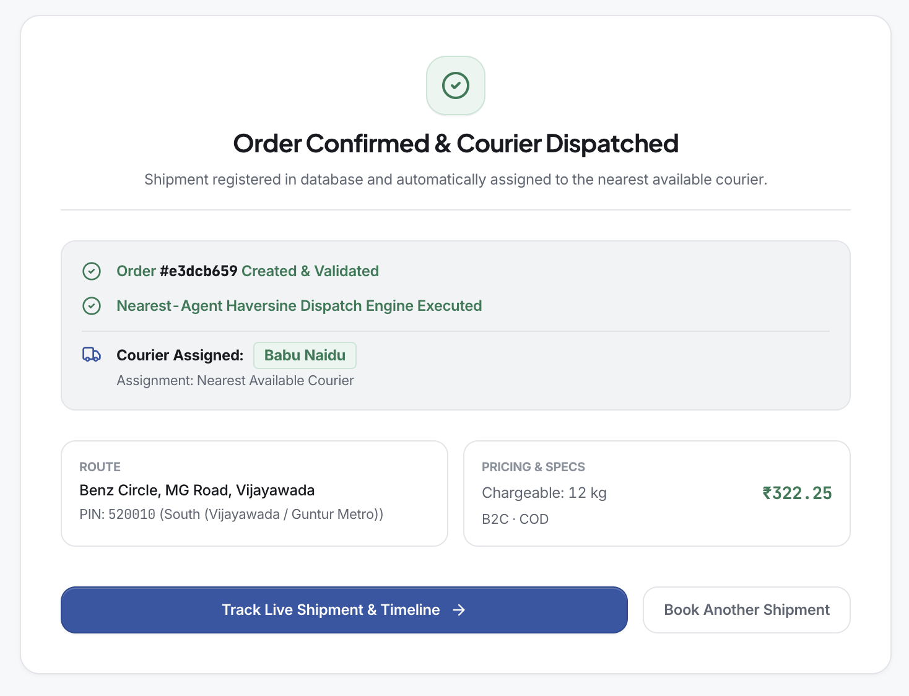
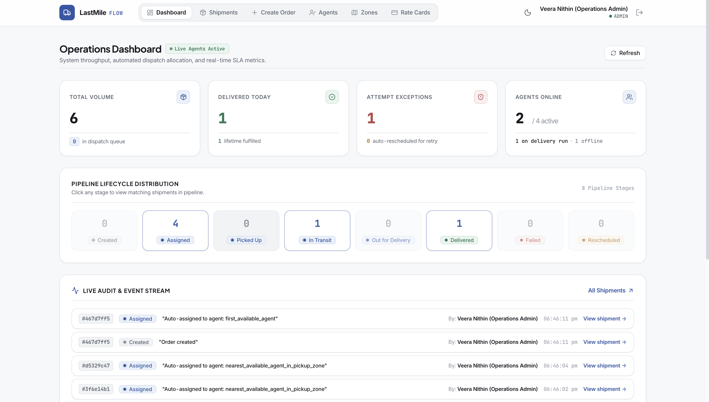
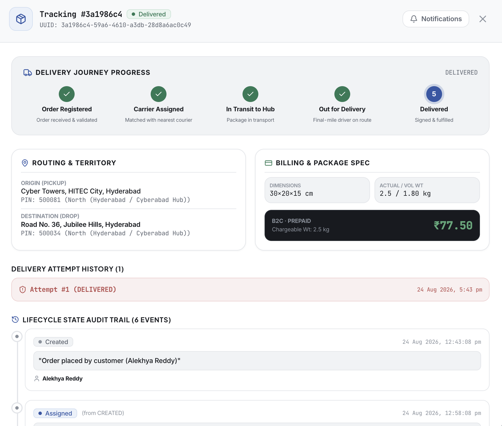

# LastMile Flow

A production-minded last-mile delivery and dispatch platform with database-driven pricing, automatic nearest-agent assignment, concurrency-safe capacity reservation, immutable tracking history, and failed-delivery recovery.

[](https://github.com/Nithin1138/Last-Mile-Delivery-Tracker/actions/workflows/ci.yml)

| | URL |
|---|---|
| **Live Frontend** | [https://lastmileflow.vercel.app/](https://lastmileflow.vercel.app/) |
| **Backend API** | [https://lastmile-backend-f1ma.onrender.com/](https://lastmile-backend-f1ma.onrender.com/) |
| **Swagger Docs** | [https://lastmile-backend-f1ma.onrender.com/docs](https://lastmile-backend-f1ma.onrender.com/docs) |
| **Repository** | [https://github.com/Nithin1138/Last-Mile-Delivery-Tracker](https://github.com/Nithin1138/Last-Mile-Delivery-Tracker) |

---

## Engineering Highlights

- **Database-driven pricing engine** — Volumetric/chargeable weight calculation with B2B/B2C rate cards, INTRA/INTER zone detection, and COD surcharge matrix. All charges are frozen on the order at creation time; editing a rate card never mutates historical invoices.
- **Haversine nearest-agent dispatch** — Automatic assignment fires immediately after order creation. Three-tier ranking: GPS proximity, zone match preference, load balancing. No admin action required.
- **Atomic capacity reservation** — Concurrency-safe `UPDATE ... WHERE current_load < max_capacity` with rowcount verification prevents double-allocation when simultaneous orders target the same agent.
- **Failed-delivery recovery** — Agent marks delivery failed with reason. Customer reschedules. System atomically releases Agent #1, runs the assignment pipeline, assigns Agent #2, creates Delivery Attempt #2, and notifies the customer.
- **Immutable audit history** — Append-only `OrderStatusHistory`, `AssignmentDecision`, and `Notification` tables protected by PostgreSQL triggers and SQLAlchemy ORM event listeners. Terminal delivery attempts are permanently locked.
- **Server-side RBAC** — JWT authentication with bcrypt password hashing. Customer sees own resources, Agent sees assigned deliveries, Admin has operational control. 19 automated RBAC tests.
- **Deterministic test suite** — 73 test functions collected (72 passed, 1 skipped). The skipped test is the optional live email-provider smoke test, intentionally isolated from the automated suite.

---

## Architecture



---

## Core Business Flow



---

## 5-Minute Evaluator Flow

The application comes pre-seeded with realistic operational data. For a detailed step-by-step walkthrough, see [docs/demo-guide.md](docs/demo-guide.md).

> **Evaluation Notes**:
> - **Render Backend Cold-Start**: Free-tier Render instances spin down when idle; the first request may take 30–60s to wake the container. Subsequent requests execute with sub-millisecond database queries.
> - **Haversine Proximity Metric**: Agent proximity ranking computes Great-Circle Haversine distance (straight-line) rather than road routing — an intentional design decision for determinism, zero external API latency, and 100% offline testability.

```text
1. Customer Login → Create order (50×40×30 cm, 8 kg, COD)
   → Observe price: Volumetric 12 kg, Base ₹290, COD ₹32.25, Total ₹322.25
   → Confirm → System auto-assigns nearest agent (Babu Naidu)

2. Admin Login → Orders tab → Order shows ASSIGNED
   → Inspect assignment audit: Haversine ranking, candidates, dispatch decision

3. Agent Login → Progress: Picked Up → In Transit → Out for Delivery
   → Mark Failed (reason: "Customer unreachable")

4. Customer Login → Open order → Delivery Attempt #1 = FAILED
   → Click "Reschedule Delivery"
   → System releases Agent #1, auto-assigns Agent #2 (Srinivas Rao), creates Attempt #2

5. Agent Login → Mark Delivered
   → Open Order Details → Complete timeline: Attempt #1 FAILED, Attempt #2 DELIVERED
```

---

## Evaluator Demo Credentials

These are seeded demonstration accounts intended only for evaluation.

| Role | Name | Email | Password |
|---|---|---|---|
| **Admin** | Veera Nithin | `admin@lastmile.dev` | `admin123` |
| **Customer (B2C)** | Alekhya Reddy | `alekhya.reddy@gmail.com` | `customer123` |
| **Customer (B2B)** | Pujitha Rao | `pujitha.logistics@andhraexports.in` | `customer123` |
| **Agent** | Babu Naidu | `babu.naidu@delivery.dev` | `agent123` |
| **Agent** | Srinivas Rao | `srinivas.rao@delivery.dev` | `agent123` |
| **Agent** | Kalyan Varma | `kalyan.varma@delivery.dev` | `agent123` |
| **Agent** | Ananya Chowdary | `ananya.chowdary@delivery.dev` | `agent123` |

---

## Tech Stack

- **Backend**: Python 3.12, FastAPI, SQLAlchemy 2.0, Pydantic v2, PostgreSQL
- **Frontend**: React 19, TypeScript, Vite, Tailwind CSS v4, Lucide Icons
- **Security**: JWT (HS256), bcrypt, server-side RBAC
- **Testing**: Pytest — 73 collected, 72 passed, 1 skipped, 0 failed
- **CI/CD**: GitHub Actions, Docker Compose, Render Blueprint
- **Notifications**: Console provider (local) + Resend email provider (production)

## Product Screenshots

| 1. Dynamic Pricing Preview | 2. Immediate Auto-Assignment |
|:---:|:---:|
|  |  |
| *Real-time volumetric & COD calculation* | *Nearest-agent Haversine dispatch* |

| 3. Operations Dashboard | 4. Complete Audit Timeline |
|:---:|:---:|
|  |  |
| *Fleet load & status pipeline* | *Immutable lifecycle history* |

> **Screenshot Capture**: Capture instructions are documented in [docs/screenshot-plan.md](docs/screenshot-plan.md).

---

## Rate Calculation Engine

Pricing is fully database-driven and follows the calculation rules defined by the assignment.

### 1. Volumetric Weight

```text
Volumetric Weight (kg) = (Length cm × Breadth cm × Height cm) / 5000
```

### 2. Chargeable Weight

```text
Chargeable Weight = max(Actual Weight, Volumetric Weight)
```

### 3. Zone Relation

- **INTRA**: Pickup zone == Drop zone
- **INTER**: Pickup zone != Drop zone

### 4. Base Delivery Charge

```text
Base Charge = RateCard.base_fee + (RateCard.rate_per_kg × Chargeable Weight)
```

### 5. COD Surcharge (if payment is Cash on Delivery)

```text
COD Charge = CODSurcharge.flat_amount + (CODSurcharge.percent_of_base / 100 × Base Charge)
```

### 6. Total Charge

```text
Total = Base Charge + COD Charge
```

### Worked Example

```text
Dimensions:       50 × 40 × 30 cm
Actual Weight:    8 kg
Volumetric:       (50 × 40 × 30) / 5000 = 12.00 kg
Chargeable:       max(8, 12) = 12.00 kg
Route:            Hyderabad (North) → Vijayawada (South) = INTER zone
Order Type:       B2C
Base Charge:      ₹50 + (₹20 × 12) = ₹290.00
COD Surcharge:    ₹25 + (2.5% × ₹290) = ₹32.25
Total Payable:    ₹322.25
```

### Immutable Historical Pricing

When an order is confirmed, all computed charge components are frozen on the `orders` record. Editing a rate card deactivates the current version and inserts version N+1. A database-level partial unique index (`uq_rate_cards_one_active_per_type`) guarantees only one active card exists per `(order_type, zone_type)`.

---

## Concurrency-Safe Auto-Assignment

To prevent race conditions where simultaneous orders over-allocate agent capacity, the system executes an atomic conditional update with rowcount verification:

```sql
UPDATE delivery_agents
SET current_load = current_load + 1,
    availability_status = CASE
        WHEN current_load + 1 >= max_capacity THEN 'BUSY'
        ELSE 'AVAILABLE'
    END
WHERE id = :agent_id
  AND availability_status = 'AVAILABLE'
  AND current_load < max_capacity;
```

- `rowcount == 1`: Reservation succeeded.
- `rowcount == 0`: Another transaction claimed the agent. Algorithm advances to the next candidate.

### Three-Tier Ranking

1. **Haversine proximity** — Nearest agent to pickup coordinates (GPS great-circle distance computed via pluggable `DistanceProvider` protocol in [`backend/app/services/distance.py`](backend/app/services/distance.py)).
2. **Zone match preference** — Same-zone agents preferred as tie-breaker.
3. **Load balancing** — Least-loaded eligible agent selected.

*(See [docs/architecture.md](docs/architecture.md#5-proximity--distance-engine-strategy-distanceprovider-protocol) for road-distance trade-offs and enterprise provider extensibility).*

---

## Database Schema

```text
             ┌───────────────┐
             │     Users     │
             └───────┬───────┘
                     │ (1:N)
       ┌─────────────┼─────────────┐
       │             │             │
       ▼             ▼             ▼
 ┌───────────┐ ┌───────────┐ ┌───────────────┐
 │  Orders   │ │   Zones   │ │DeliveryAgents │
 └─────┬─────┘ └─────┬─────┘ └───────┬───────┘
       │             │ (1:N)         │
       │             ▼               │
       │       ┌───────────┐         │
       │       │   Areas   │         │
       │       └───────────┘         │
       ├─────────────────────────────┤
       │                             │
       ▼ (1:N) RESTRICT              ▼ (1:N) RESTRICT
 ┌───────────────────┐        ┌───────────────────┐
 │ OrderStatusHistory│        │ DeliveryAttempts  │
 └───────────────────┘        └───────────────────┘
```

### Immutability Invariants

- **Append-only audit tables**: `OrderStatusHistory`, `AssignmentDecision`, `Notification` — SQL `UPDATE`/`DELETE` blocked by PostgreSQL triggers and ORM event listeners.
- **Terminal delivery attempt lock**: Attempts in `FAILED` or `DELIVERED` status are permanently immutable.
- **Foreign key RESTRICT**: `ondelete="RESTRICT"` prevents cascading deletion of parent orders.
- **Actor-scoped idempotency**: `IdempotencyKey` stores `(user_id, key)` with composite uniqueness.

---

## REST API Reference

| Method | Endpoint | Access | Description |
|---|---|---|---|
| `POST` | `/api/auth/register` | Public | Register customer account |
| `POST` | `/api/auth/login` | Public | Authenticate and return JWT |
| `GET` | `/api/auth/me` | Authenticated | Current user profile |
| `POST` | `/api/orders/quote` | Customer / Admin | Live rate preview |
| `POST` | `/api/orders` | Customer / Admin | Create order with price freeze |
| `GET` | `/api/orders` | Scoped | List orders (role-filtered) |
| `GET` | `/api/orders/{id}` | Owner / Agent / Admin | Order details |
| `POST` | `/api/orders/{id}/status` | Agent / Admin | Transition order status |
| `POST` | `/api/orders/{id}/assign` | Admin | Auto-dispatch or manual assign |
| `POST` | `/api/orders/{id}/reschedule` | Owner / Admin | Reschedule failed order |
| `GET` | `/api/orders/{id}/timeline` | Owner / Agent / Admin | Immutable audit log |
| `GET` | `/api/orders/{id}/attempts` | Owner / Agent / Admin | Delivery attempts list |
| `GET` | `/api/orders/{id}/assignments` | Owner / Agent / Admin | Assignment decision audit |
| `GET` | `/api/admin/dashboard` | Admin | Fleet metrics and pipeline |
| `GET/POST` | `/api/admin/agents` | Admin | Agent management |
| `GET/POST` | `/api/admin/zones` | Admin | Zone management |
| `GET/POST` | `/api/admin/areas` | Admin | Pincode area mapping |
| `GET/POST` | `/api/admin/rate-cards` | Admin | Rate card versioning |
| `GET/POST` | `/api/admin/cod-surcharges` | Admin | COD surcharge config |

---

## Local Setup

### Prerequisites

- Python 3.12+, Node.js 20+, PostgreSQL on port 5432

### Backend

```bash
cd backend
python3 -m venv venv
source venv/bin/activate
pip install -r requirements.txt
cp .env.example .env
python seed.py
uvicorn app.main:app --port 8000 --reload
```

### Frontend

```bash
cd frontend
npm install
npm run dev
```

Open `http://localhost:5173`.

### Docker Compose (full stack)

```bash
docker compose up --build
```

This starts PostgreSQL, the FastAPI backend, and the Nginx-served frontend together.

---

## Automated Test Suite (73 Tests)

```bash
cd backend && source venv/bin/activate && pytest tests/ -v
```

```text
73 collected, 72 passed, 1 skipped, 0 failed
```

The skipped test is the optional live external email-provider smoke test, intentionally isolated from the deterministic suite.

For detailed test architecture and coverage, see [docs/testing-strategy.md](docs/testing-strategy.md).

### Test Modules

| Module | Tests | Coverage Area |
|---|:---:|---|
| `test_security_rbac.py` | 19 | RBAC, ownership isolation, immutability enforcement |
| `test_pricing_engine.py` | 8 | Volumetric weight, rate cards, COD surcharges |
| `test_concurrency.py` | 7 | Multithreaded race conditions, atomic claims |
| `test_api.py` | 7 | RBAC enforcement, idempotency, rate versioning |
| `test_assignment_engine.py` | 6 | Haversine ranking, auto-dispatch on creation |
| `test_notifications.py` | 6 | Provider abstraction, audit logging |
| `test_order_lifecycle.py` | 5 | State machine, illegal transitions, history |
| `test_failed_delivery_flow.py` | 5 | Full failure/reschedule/reassignment flow |
| `test_zone_service.py` | 4 | Pincode resolution, inactive area rejection |
| `test_distance.py` | 4 | Haversine formula mathematical accuracy |
| `test_e2e_smoke.py` | 2 | Multi-role end-to-end journey |

---

## Cloud Deployment

### Render Blueprint (recommended)

1. Connect this repository to [Render](https://render.com).
2. Click **New → Blueprint** and select `render.yaml`.
3. Render provisions PostgreSQL, builds the backend, and deploys the frontend.

### Docker

```bash
docker compose up --build
```

---

## Documentation

- [Demo Guide (Evaluator Walkthrough)](docs/demo-guide.md)
- [System Architecture](docs/architecture.md)
- [System Benchmarks & Latency Report](docs/benchmarks.md)
- [Testing Strategy](docs/testing-strategy.md)
- [System Design Write-Up](docs/system-design.md)
- [Requirements Mapping](docs/requirements-mapping.md)
- [Operational Runbook](docs/operational_runbook.md)
- [Notification Verification](docs/external_notification_verification.md)
- [Screenshot Plan](docs/screenshot-plan.md)

---

## Building Submission Archive

```bash
python3 scripts/package_submission.py
```
